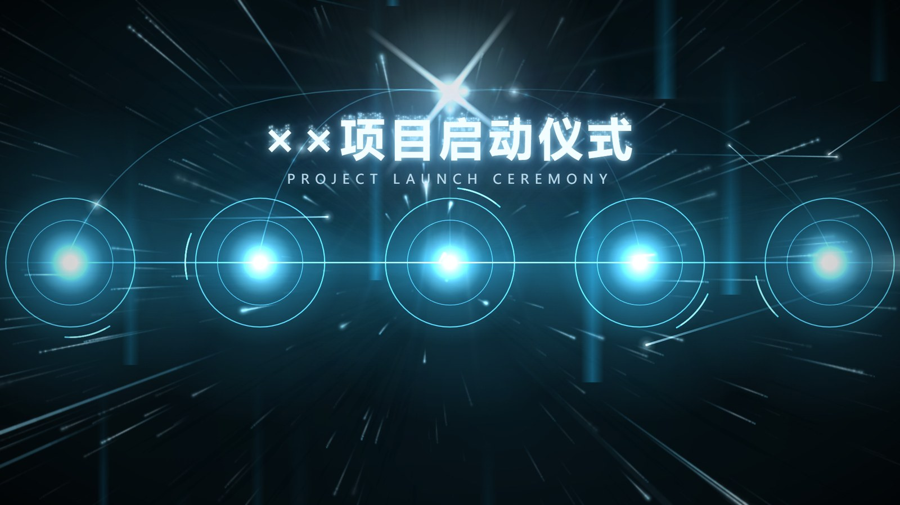
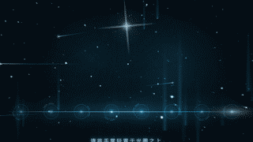
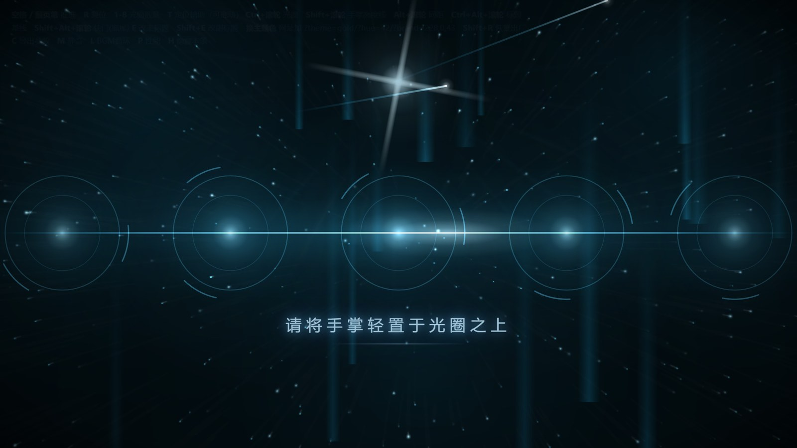
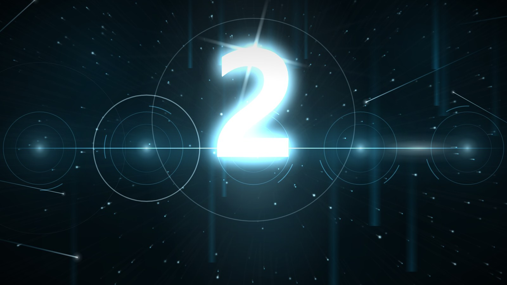
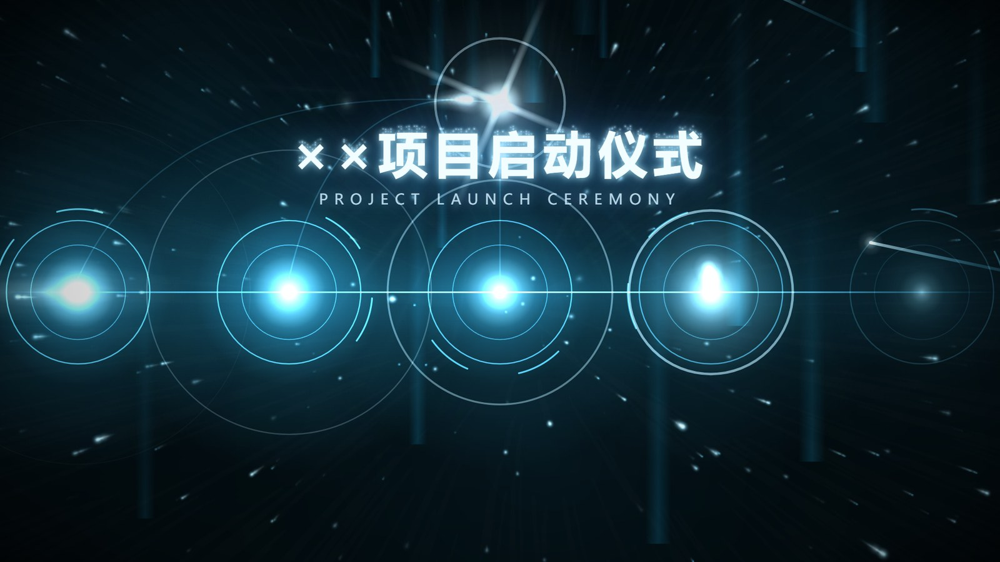
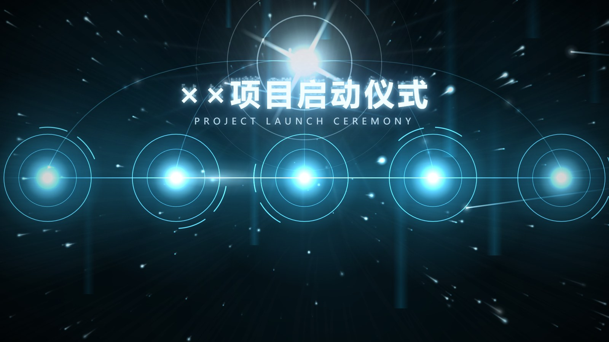
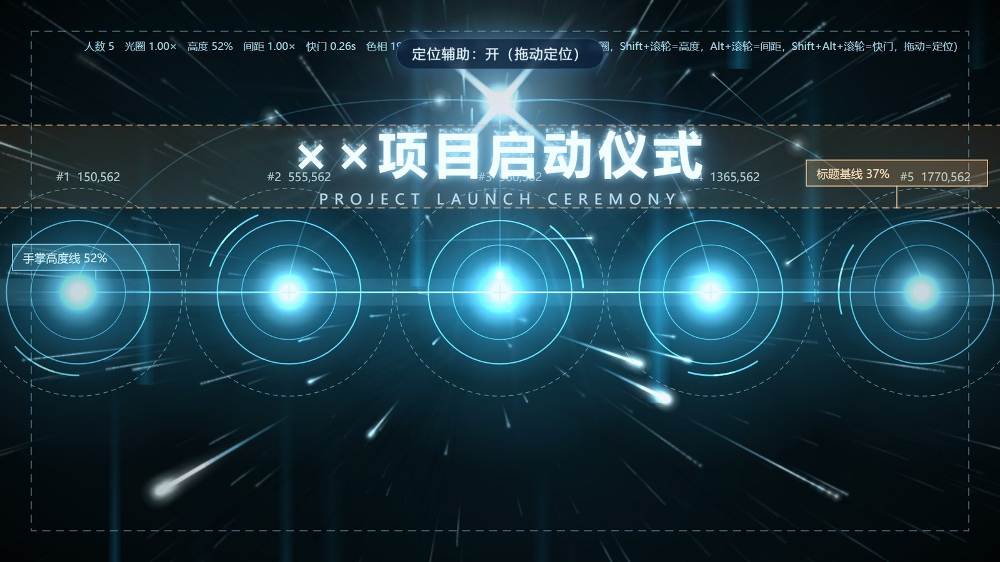
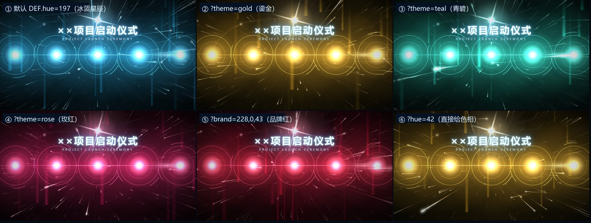

# 启动仪式大屏 · 星辰大海

[](#)
[](#)
[](#)

面向大会 / 峰会 / 发布会**「启动仪式」**环节的大屏全屏组件。零依赖、零构建、断网可跑——**双击 `index.html` 就能上大屏**。

设计前提是最坏现场：**酒店会议室 + 一台 Windows 电脑 + 一路 HDMI**，没有中控、没有触发器、没有 mixer。
台上的"领导把手放在光圈上"是**演**的（屏幕不需要真交互），真正推进画面的是**后台人员按一下键**（空格，或一支 30 元的 USB 翻页笔）。



---

## 目录

- [效果预览](#效果预览)
- [快速开始](#快速开始)
- [现场调试流程](#现场调试流程)
- [完整键位表](#完整键位表)
- [常见大屏比例](#常见大屏比例)
- [换主题色](#换主题色)
- [URL 参数](#url-参数)
- [技术实现](#技术实现)
- [性能与已知限制](#性能与已知限制)
- [兼容性](#兼容性)
- [目录结构](#目录结构)
- [版权与许可](#版权与许可)
- [English](#english)

---

## 效果预览

总览：



| ① 待机 | ② 3D 倒计时 |
|---|---|
|  |  |

| ③ 逐个点亮（星尘开始汇字） | ④ 逐条流光冲向顶部 |
|---|---|
|  |  |

| ⑤ 定格（永久保持，随时拍照） | ⑥ 定位辅助（现场标定用） |
|---|---|
|  |  |

六种主题色（同一套美术，只换色相）：



**分镜流程**：待机 → （按一次）3D 倒计时 → 逐个点亮 + 逐条流光冲顶 → （再按一次）定格常亮 → （再按）复位。

---

## 快速开始

### 1. 下载

在本仓库页面点绿色的 **`Code`** 按钮 → **`Download ZIP`**。

> 直链：`https://github.com/MWTJC/launch-ceremony/archive/refs/heads/main.zip`

也可以 `git clone`：

```bash
git clone https://github.com/MWTJC/launch-ceremony.git
```

### 2. 解压

解压到**任意文件夹**即可。⚠️ 请保持目录结构完整——`index.html` 通过相对路径加载 `styles.css`、`app.js`、`bgm/victory.mp3`，**不要把 `index.html` 单独拖出来**。

### 3. 双击运行

**双击 `index.html`**，用默认浏览器（Chrome / Edge）打开。

- 不需要安装任何东西，不需要 Node、不需要联网；
- 现场电脑建议：**把整个文件夹拷过去**，双击即跑，切 HDMI 5 秒完成。

### 4. 全屏

按 **`F11`** 进入浏览器全屏（页面内按 **`F`** 亦可）。

> 想要"无浏览器痕迹"（无地址栏、无标签页、鼠标自动隐藏、不弹恢复会话），可以用 Chrome/Edge 的 kiosk 模式：
> ```bat
> msedge --kiosk --user-data-dir="%TEMP%\ceremony-profile" "file:///你的路径/index.html"
> ```
> kiosk 模式下退出用 `Alt+F4`。

### 5. 走一遍

按 **空格** 推进分镜，看完整流程是否符合预期。左上角有操作提示条，按 `H` 可收起。

---

## 现场调试流程

> 核心思路：**先让画面符合物理现实，再谈好看**。图上的三个东西必须和现场对齐——**1) 领导放手的高度、2) 领导站位的疏密、3) 光圈大小**。

**步骤**

1. **设定人数**：按 `1`～`8` 直接改光圈数量（= 上台领导人数）。人数未定也没关系，彩排时再按。
2. **打开定位辅助**：按 `T`。此时会出现：
   - **青色线** = 手掌高度线（可整条拖动，拖动会把所有光圈复位到该高度）
   - **橙色线 + 色块** = 标题基线及标题所占区域（可拖动）
   - 每个光圈显示编号与坐标，**可单独拖动**对齐领导实际站位
3. **对齐高度**：拖青色线到领导放手的高度。经验值：整屏高度的 **45%～58%**。
4. **对齐疏密与大小**：`Alt+滚轮` 调整整排间距、`Ctrl+滚轮` 调整光圈大小（也可逐个拖动光圈）。
5. **检查冲突**：若有光圈顶到标题区，画面中会**红字告警**并给出改法；再按 `Ctrl+Alt+滚轮` 或直接拖动橙色线决定标题高度。
6. **固化标定**：按 `C` 导出参数网址（已复制到剪贴板，同时显示在左下角）。把它贴回地址栏、或写进交付说明，下次打开就是这套标定。
   > 标定数据同时自动存进浏览器 `localStorage`，同一台电脑重开不丢。
7. **收尾**：按 `T` 关掉辅助线，按 `H` 收起提示条，按 `F11` 全屏，等开场。

**要清空标定回到出厂默认**：按 `Shift+R`。

**其他现场手感调节**

| 想要的效果 | 怎么调 |
|---|---|
| 拖尾太长/太短（"跃迁感"强弱） | `Shift+Alt+滚轮` 调快门时间；默认 0.26s，收敛到 0.16～0.18s 会优雅很多 |
| 拖尾整体不要 | 按 `B`，或网址加 `?trail=0` |
| 不要 3D 倒计时 | 网址加 `?count=0` |
| 不要星尘汇字 | 网址加 `?dust=0` |
| 电脑卡 | 按 `P` 切性能模式（去拖影、减星点）；网页会自动检测帧率并降级 |
| 改标题/副标题 | `E` 改主标题、`Shift+E` 改副标题（回车确认、Esc 取消），会记住 |

---

### 现场踩点与应急预案

**踩点（提前一天到现场做）**

1. 确认大屏实际分辨率与比例（决定是否需要微调，见[常见大屏比例](#常见大屏比例)）；
2. 试投一眼颜色：金色在部分 LED 上会偏橙，必要时[换主题色](#换主题色)；
3. LED 屏建议把亮度压到 60～70%（不压的话照片里屏是死白、人是剪影）；投影相反要拉满并关灯；
4. 开 `T` 检查 title-safe 5% 框有没有被 LED 边框吃掉；
5. 现场电脑：关电源休眠与屏保、关 Windows 通知、关自动更新、插电源。

**应急**

- **双机**：同一份文件夹拷两台笔记本，双击即起，切 HDMI 只需 5 秒；
- **兜底视频**：彩排时录一段 30 秒的定稿定格态放桌面——万一网页出问题直接全屏播它，**照片效果完全一样**（因为是同一个画面）；
- **离线**：本组件零网络依赖，会场 WiFi 断了不影响。

---

## 完整键位表

| 键 | 作用 |
|---|---|
| **空格 / 回车 / → / PageDown / 鼠标左键** | **推进下一分镜**（翻页笔、无线演示器天然就是这个键） |
| `R` | 复位回待机（并停止 BGM） |
| `Shift+R` | 清空现场标定，恢复出厂默认 |
| `1` ～ `8` | 光圈数量 |
| `T` | 定位辅助开关（**开启后才可拖动定位**） |
| `Ctrl+滚轮` | 光圈大小 |
| `Shift+滚轮` | 手掌高度线 |
| `Alt+滚轮` | 整排间距 |
| `Ctrl+Alt+滚轮` | 标题基线 |
| `Shift+Alt+滚轮` | 快门时间（拖尾物理长度） |
| `,` `.` | 标题基线 − / ＋ |
| `[` `]` | 光圈大小 − / ＋ |
| `;` `'` | 高度线 − / ＋ |
| `-` `=` | 间距 − / ＋ |
| `E` / `Shift+E` | 编辑主标题 / 副标题 |
| `B` | 粒子拖尾开关 |
| `C` | 导出当前标定参数（复制 + 显示） |
| `M` / `L` | BGM 静音 / 循环 |
| `F` | 全屏　`P` 性能模式　`H` 隐藏提示条 |

---

## 常见大屏比例

设计画布宽度会**自动跟随屏幕比例**，不需要黑边或拉伸：

| 屏幕 | 设计画布 | 缩放 |
|---|---|---|
| 16:9 1920×1080 | 1920 | 1.000 |
| 16:10 1680×1050 | 1728 | 0.972 |
| 4:3 1440×1080 | 1440 | 1.000 |
| 21:9 2560×1080 | 2560 | 1.000 |
| 32:9 3840×1080（双屏拼接） | 3840 | 1.000 |
| 4:3 1024×768（老投影） | 1440 | 0.711（留边） |

> 注意：**"用浏览器自带缩放（Ctrl+滚轮）调比例"是无效的**——等比 contain 设计会把浏览器缩放精确抵消（实测 100%/125%/150% 三档下，舞台的设备像素宽度都是 1920）。所以本组件的 `Ctrl+滚轮` 被拦截改作现场标定用。

---

## 换主题色

所有元素（星野 / 光圈 / 流光 / 标题 / 星尘）取自**同一色相**，只以明度与透明度分层，**改一个色相就是整体换肤**。

**优先级（左高右低）**：`?brand=` > `?theme=` > `?hue=` > `DEF.hue`（文件默认）

| 改法 | 用法 |
|---|---|
| 选预设 | `index.html?theme=gold` |
| 给色相 | `index.html?hue=42` |
| 给品牌色 | `index.html?brand=228,0,43`（反推色相，主色直接用品牌色本身） |
| 永久默认 | 改 `app.js` 里 `DEF.hue` |

内置预设：`ice` 197 冰蓝星辰（默认）· `deepblue` 212 深海蓝 · `violet` 282 蓝紫 · `teal` 172 青碧 · `gold` 42 鎏金 · `rose` 338 玫红

**加自己的主题**（`app.js` 的 `THEMES` 表里加一行）：

```js
mycolor: { hue: 160, hot: '230,255,245', name: '我的主题' },
```

- `hot` 是**核心白**：暖色主题（金/红）必须换成偏暖的白，否则中心会发青发脏。
- 主题色**不读 `localStorage`**，只认 URL 与文件默认值——避免改了文件却被现场旧存档覆盖（现场标定仍正常持久化，两者互不干扰）。

**精确控制每个色阶**：直接改 `app.js` 里的 `C` 对象（7 个 `R,G,B` 字符串），`deep` 务必保持很暗，大屏拍照才不脏。

---

## URL 参数

```
?n=5            光圈数量（1-8）
?ring=1.15      光圈大小系数
?line=0.52      手掌高度线（0-1）
?spread=1       整排间距系数
?titley=0.37    标题基线（0-1）
?theme=gold     主题预设
?hue=197        主题色相
?brand=228,0,43 品牌色（R,G,B）
?shutter=0.26   快门时间 = 拖尾物理长度（秒）
?count=3        3D 倒计时（0=关）
?dust=1         星尘汇字标题（0=关）
?trail=1        粒子拖尾（0=关）
?dpr=2          以真 4K（3840×2160）像素渲染
?perf=1         性能模式
?pos=x,y;x,y;…  光圈绝对定位（由 `C` 键导出）
?title=…&sub=…  标题 / 副标题文字
```

---

## 技术实现

**零依赖**：没有框架、没有构建、没有 CDN、没有字体请求。一个 HTML + 一个 CSS + 一个 JS。

- **3D 星野**：手写透视投影（相机 yaw / pitch / 焦距）在 2D Canvas 上做真三维景深，720 颗星带深度衰减与闪烁。透视投影思路参考了 [rstyro/html5](https://github.com/rstyro/html5) 的 `project3D`，代码为本项目重写。
- **物理拖尾**：对同一颗星在 `t − 快门时间` 时刻**再做一次透视投影，两点连线**。因为透视把空间直线仍映射为直线，这条连线是**数学精确解**——长度与方向由景深和星速自发决定，指向真实消失点（≠ 屏幕中心）。
  > 实测：快门 0.26 → 0.52 → 0.78 s 时，平均拖尾 90.6 → 153.4 → 208.2 px，呈**次线性**增长（透视压缩的正确特征）。
- **拖影缓冲**：半分辨率画布做 `destination-out` 逐帧衰减 + `lighter` 合成，只负责柔光辉光，不承担长度，避免把物理长度糊长。
- **涟漪光圈 / 流光**：同心环 + 旋转弧 + 核心光核；触发后逐个点亮，射出的流光沿二次贝塞尔曲线冲向顶部星芒，射线**随流光进度从光圈往上生长**（不是整条突现）。
- **星尘标题**：把标题按实际字号/字距/渲染宽度栅格化取点，粒子带随机延时从四周汇聚成字，之后常驻为标题的星尘辉光；用 `E` 改标题后目标点会重算。
- **BGM**：首次按键推进即播放（按键本身就是浏览器要求的手势），被拦截时右下角提示并自动重试。
- **弱机保护**：帧率持续 < 48 fps 时自动先关拖影、仍低则切性能模式。

---

## 性能与已知限制

**实测（1920×1080，一台 Windows 台式机上的 Chrome）**

| 场景 | fps |
|---|---|
| 待机 | 100 ～ 240 |
| 定格态（720 星 + 物理拖尾 + 星尘标题） | 88 ～ 135 |
| 性能模式 | 回到 200+ |

**主要瓶颈**：① 物理拖尾的逐段描边（每星最多 3 段 stroke）；② 拖影缓冲每帧两次全画布填充。

**已内置的缓解**：`P` 性能模式 / `B` 关拖尾 / `?trail=0` / 自动降级。

**待优化（欢迎 PR）**

- [ ] 拖尾改为一次性提交（`Path2D` 批量或烘焙"轨迹贴图"），减少 stroke 调用
- [ ] 星野的投影与绘制搬进 WebGL（或 `OffscreenCanvas` + Worker），把主线程让出来
- [ ] 拖影缓冲按 DPR 自适应，高分屏下进一步降本
- [ ] 触摸 / 移动端适配（当前为纯大屏场景，未做）
- [ ] 音效（当前只有一条 BGM，无音效点）

**其他限制**：仅验证 Chrome / Edge；Safari、Firefox 未测。真实的 LED 屏边框裁切、色偏需现场试投确认（用 `T` 的 title-safe 5% 框检查）。

---

## 兼容性

- **浏览器**：Chrome / Edge（Windows 自带 Edge 即可）。代码为纯 ES5 语法 + Canvas 2D，无构建、无依赖。
- **`file://` 直开**：可用。`localStorage` 在 `file://` 下工作正常（已实测，标定能持久化）。
- **建议**：现场电脑用便携版 Chrome/Edge + kiosk 模式，避免扩展与通知干扰。

---

## 目录结构

```
.
├── index.html          页面外壳（双击这个）
├── styles.css          标题 / 引导语 / 提示条
├── app.js              全部引擎（约 1900 行，纯 ES5 语法，无构建）
├── bgm/
│   └── victory.mp3     触发时播放的背景音乐（可替换为自己的）
├── docs/               README 用预览图
└── README.md
```

---

## 版权与许可

- **代码**：未附许可文件，默认保留所有权利。如需开源请补一份 LICENSE（MIT / Apache-2.0 均可）。
- **`bgm/victory.mp3`**：演示用音乐，**请自行确认授权**后再公开或商用；删掉该文件程序仍能正常运行，只是没有音乐。
- **`docs/*.jpg`**：本项目界面截图，可随仓库发布。
- **早期设计阶段的风格参考图未收录**（避免第三方图片版权问题）。
- 致谢 [rstyro/html5](https://github.com/rstyro/html5) 的 3D 投影思路。

---

## English

A zero-dependency, single-page **launch-ceremony big-screen visual** for conferences and product launches, designed for the worst-case venue: one Windows laptop and one HDMI cable, no show-control hardware.

- Open `index.html` by double-click; press **F11** for fullscreen; press **Space** (or a wireless presenter) to advance the cue.
- Stages: standby → 3D countdown → five ripple halos ignite one by one, each firing a bezier light streak to a top star → stable finale (safe for photography at any moment).
- Hand-written perspective projection drives a 720-star 3D starfield; **motion trails are physically derived** (project the same star at `t − shutter` and connect the two projected points), so their length and direction follow real perspective.
- On-site calibration with the mouse (`T`), the scroll wheel, and `C` to export parameters. Six colour themes; `?brand=r,g,b` derives a theme from your brand colour.
- No build step, no CDN, no network required. Chrome / Edge.
